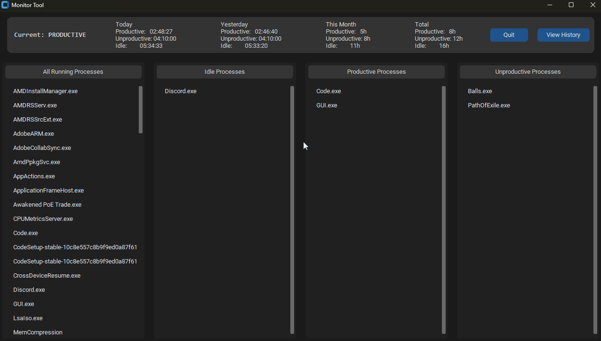

# Monitor Tool

A simple Windows desktop application that tracks your productivity by monitoring which applications you use.  
It automatically categorizes time spent as **Productive**, **Unproductive**, or **Idle** and displays the statistics in real-time.

**Demo:**


### Features
- Tracks time in Productive, Unproductive, and Idle categories (day / month / total)
- Color-coded system tray icon (Green = Productive, Red = Unproductive, Black = Idle)
- View and manage running processes
- Assign apps to productive/unproductive/idle categories
- Runs minimized to the tray
- Auto-saves your data every 20 seconds
- Lightweight and works on any Windows PC

### How to Use

1. Go to https://github.com/SirSidge/monitor_tool/releases
2. Download the latest `MonitorTool.exe`.
3. Double-click the exe to run the app.

**Optional:** To start automatically with Windows:
- Press `Win + R`, type `shell:startup`, press Enter.
- Copy `MonitorTool.exe` (or create a shortcut) into that folder.

### How to Clone and Run from Source

```bash
# 1. Clone the repository
git clone https://github.com/SirSidge/monitor_tool.git
cd monitor_tool

# 2. Install dependencies
pip install customtkinter pystray pillow psutil

# 3. Run the app
python monitor_tool.py